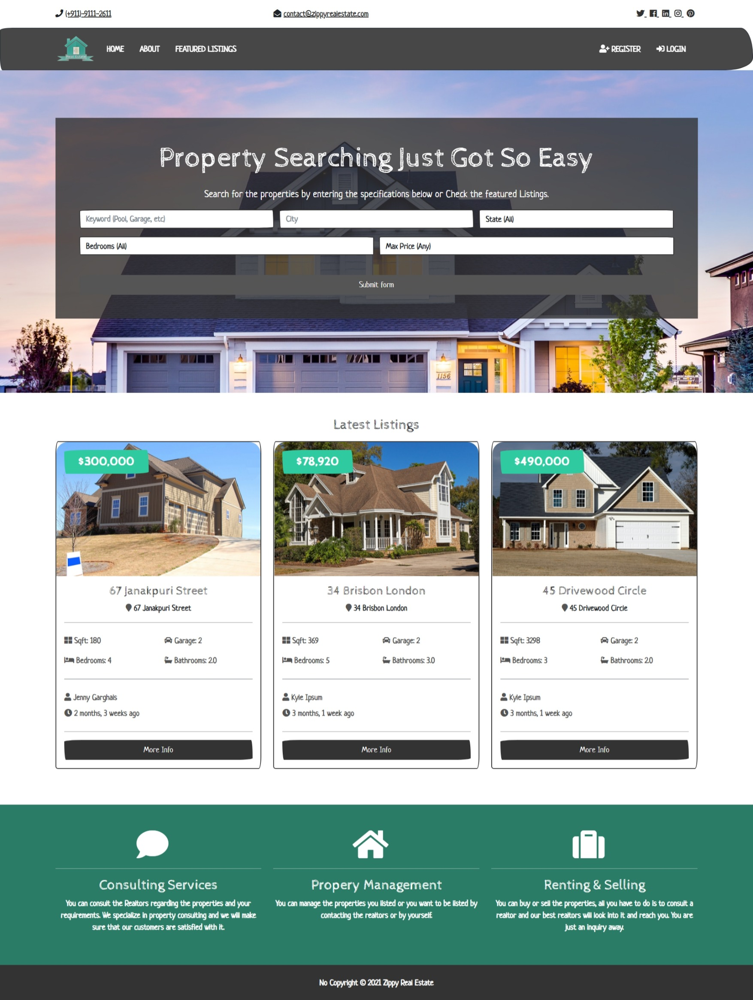

# Real Estate

***Real Estate App made using Django. User can login and Signup and can make queries regarding property listings to the realtors. The Realtors will receive the queries and contacts the person on the email and contact details provided.***

### Technologies Used
- Python
- Django
- PostgreSQL
- SMTP can be added with your credentials in the settings.py
- Jinja
- **For other requirements please check `requirements.txt file` and use virtual environment.**

### Apps present:
- accounts
- contacts
- listings
- pages
- realtors
- real_estate

### Instructions
Use following instructions in console
- To runserver or app ``python manage.py runserver``

- To Collect static files if updated ``python manage.py collectstatic``
- To create superuser to access admin panel ``python manage.py createsuperuser``

## ScreenShots
### Home Page

### About Page

### Admin Panel

### Feature Listings Page

### Listing Page

### Login and Register Page

### Query Page

